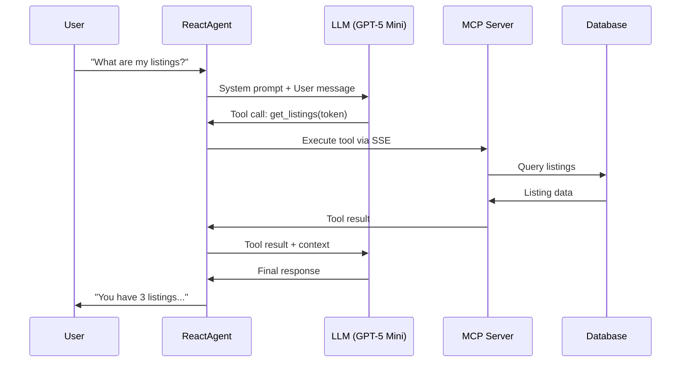
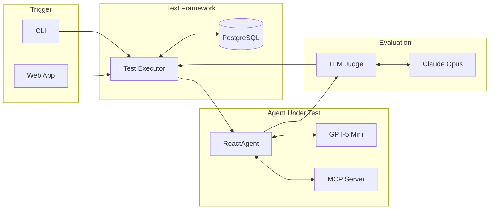

## The Testing Challenge

AI agents are becoming critical infrastructure. From customer support to data analysis, organizations are deploying agents that make decisions, call APIs, and generate responses autonomously. But this raises a fundamental question: **how do you test something that produces non-deterministic outputs?**

Traditional software testing relies on deterministic assertions. Given input X, expect output Y. But when an LLM is at the core of your system, the same prompt can produce semantically equivalent but textually different responses every time. Your agent might say "You have 3 properties" today and "I found three listings for you" tomorrow. Both are correct, but `assertEqual` will fail.

This post introduces the **LLM-as-judge pattern**, a technique we developed to solve this problem. We'll walk through how we built an end-to-end testing framework for our AI agent that uses a separate, more capable LLM to evaluate responses, enabling reliable automated testing of inherently non-deterministic systems.

## What is an AI Agent?

Before diving into testing, let's establish what we mean by an "agent." At its core, an AI agent consists of three components:

### 1. The Harness (System Prompt)

The harness defines the agent's personality, constraints, and context. It's the system prompt that shapes how the LLM behaves, what it knows about itself, and what rules it should follow.

```python
system_message = """You are a helpful assistant for a property management platform.
You help users understand their listings, bookings, and revenue data.
Always be concise and accurate. Use the tools available to fetch real data.
Today's date is {today}. Respond in {locale}."""
```

### 2. The Reasoning Loop (ReAct Pattern)

The agent uses a reasoning loop to decide what to do next. We implement the ReAct (Reasoning + Acting) pattern via LangGraph, where the LLM can:
- Reason about the user's request
- Decide which tool to call
- Process tool results
- Generate a final response

### 3. The Tools (MCP Server)

Tools give the agent real capabilities. We use the Model Context Protocol (MCP) to expose tools via an SSE server. The agent can call tools like `get_listings`, `get_bookings`, or `get_revenue_data` to fetch real information from our database.

Here's how these components interact in a typical request:



## Why Traditional Assertions Fail

Consider this test case: "Ask the agent for a list of properties and verify it returns them correctly."

With traditional testing, you might write:

```python
def test_get_listings():
    response = agent.invoke("What are my listings?")
    assert response == "You have 3 listings: Beach House, Mountain Cabin, City Apartment"
```

This test will fail immediately. The agent might respond with:
- "I found 3 properties in your portfolio: Beach House, Mountain Cabin, and City Apartment."
- "You have three listings:\n1. Beach House\n2. Mountain Cabin\n3. City Apartment"
- "Here are your 3 listings: Beach House, City Apartment, Mountain Cabin" (different order)

All three responses are correct. They contain the same information. But string matching fails because **LLMs are non-deterministic by design**. Even with temperature=0, subtle variations in tokenization, context, and model state can produce different outputs.

You could try fuzzy matching or regex, but this quickly becomes unmaintainable. How do you write a regex that matches "3", "three", and "3 properties" while rejecting "2 listings"?

The solution: **let an LLM do the evaluation**.

## The LLM-as-Judge Pattern

The core insight is simple: if an LLM can generate natural language, another LLM can evaluate it. We use a separate, more capable model as a "judge" to score the agent's responses against specific criteria.

Here's the architecture:



The judge receives three inputs:
1. **The original user prompt** - what was asked
2. **The agent's response** - what the agent said
3. **Evaluation criteria** - what constitutes a good response

It returns:
- A **score** between 0.0 and 1.0
- **Reasoning** explaining the score

Here's a simplified implementation:

```python
JUDGE_SYSTEM_PROMPT = """You are an expert evaluator of AI assistant responses. 
Your task is to score responses based on specific criteria provided by the user.

You must respond with ONLY a JSON object in this exact format:
{"score": 0.85, "reasoning": "Brief explanation of the score"}

The score must be a float between 0.0 and 1.0:
- 1.0 = Perfect response that fully meets all criteria
- 0.8+ = Good response that meets most criteria with minor issues
- 0.6-0.8 = Acceptable response with some missing elements
- 0.4-0.6 = Partial response with significant gaps
- Below 0.4 = Poor response that fails to meet criteria

Be objective and consistent in your evaluation."""


async def judge_response(
    response_content: str,
    prompt: str,
    judge_prompt: str,
    threshold: float,
    model: str = "claude-opus-4-5",
) -> JudgeResult:
    evaluation_prompt = f"""Evaluate the following AI assistant response.

<user_prompt>
{prompt}
</user_prompt>

<ai_response>
{response_content}
</ai_response>

<evaluation_criteria>
{judge_prompt}
</evaluation_criteria>"""

    client = anthropic.AsyncAnthropic()
    message = await client.messages.create(
        model=model,
        max_tokens=500,
        system=JUDGE_SYSTEM_PROMPT,
        messages=[{"role": "user", "content": evaluation_prompt}],
    )
    
    result = json.loads(message.content[0].text)
    passed = result["score"] >= threshold
    
    return JudgeResult(
        passed=passed,
        score=result["score"],
        threshold=threshold,
        reasoning=result["reasoning"],
    )
```

## The Model Hierarchy Strategy

A key design decision: **the judge should be more capable than the agent being tested**.

Our agent uses GPT-5 Mini for production, optimizing for cost and latency. But for evaluation, we use Claude Opus, a more capable model with stronger reasoning abilities.

This works because:
1. **The judge doesn't need domain knowledge** - it only evaluates whether criteria are met
2. **Evaluation is simpler than generation** - it's easier to judge quality than to produce it
3. **Cost is acceptable for testing** - you run tests less frequently than production queries

Configuration example:

```python
config = {
    "agent": {
        "model": "openai:gpt-5-mini",
    },
    "judge": {
        "model": "anthropic:claude-opus-4-5",
        "default_threshold": 0.7,
    },
}
```

## The Scoring Rubric Approach

The judge uses a consistent scoring rubric:

| Score | Meaning |
|-------|---------|
| 1.0 | Perfect response that fully meets all criteria |
| 0.8+ | Good response with minor issues |
| 0.6-0.8 | Acceptable with some missing elements |
| 0.4-0.6 | Partial response with significant gaps |
| < 0.4 | Poor response that fails to meet criteria |

Each test case defines its own evaluation criteria via a `judge_prompt`. This allows you to be specific about what matters for each scenario:

```python
test_case = {
    "name": "get_listing_details",
    "prompt": "What are the details of my Beach House listing?",
    "expected_tools": ["get_listing_details"],
    "judge_prompt": """The response should contain:
        - The listing name (Beach House)
        - The property address
        - Current pricing information
        - Occupancy rate or availability status
        The information should be formatted clearly and be easy to read.""",
    "judge_threshold": 0.7,
}
```

The threshold is configurable per test. Critical paths might require 0.9+, while exploratory features might accept 0.6.

## Multi-Round and Agent Revival Testing

Real conversations aren't single-turn. Users ask follow-up questions, refer to previous context, and expect the agent to remember what was discussed.

Our framework supports multi-round testing:

```python
test_case = {
    "name": "multi_round_conversation",
    "rounds": [
        {
            "prompt": "What are my listings?",
            "judge_prompt": "Should list all properties",
        },
        {
            "prompt": "What's the occupancy for the first one?",
            "judge_prompt": "Should reference the first listing from previous response and show occupancy data",
        },
    ],
    "test_agent_revival": True,
}
```

The `test_agent_revival` flag is particularly interesting. It tests whether the agent can:
1. Complete round 1
2. **Close the session entirely**
3. Reopen with the same agent ID
4. Continue the conversation with context preserved

This validates that your checkpointing and state persistence work correctly, catching bugs that would only appear when users return to conversations after server restarts.

## Complementary Validators

The LLM judge is powerful but not the only validator. We combine it with deterministic checks:

### Tool Validator

Verify that expected MCP tools were called:

```python
def validate_tools(response, expected_tools):
    called_tools = extract_tool_calls(response)
    missing = [t for t in expected_tools if t not in called_tools]
    return ToolValidationResult(
        passed=len(missing) == 0,
        expected_tools=expected_tools,
        called_tools=called_tools,
        missing_tools=missing,
    )
```

This is deterministic. If the test expects `get_listings` to be called and it wasn't, that's a clear failure regardless of what the response says.

### Database Validator

Verify that conversations and messages are persisted correctly:

```python
def validate_database(agent_id, verify_conversation=True, verify_messages=True):
    if verify_conversation:
        conversation = get_conversation_by_id(agent_id)
        if not conversation:
            return DatabaseValidationResult(passed=False, message="Conversation not found")
    
    if verify_messages:
        messages = get_messages_by_thread(agent_id)
        if len(messages) < 2:
            return DatabaseValidationResult(passed=False, message="Expected at least 2 messages")
    
    return DatabaseValidationResult(passed=True)
```

## The Follow-up Detection Pattern

Here's an edge case that caused many false failures: sometimes the agent asks for clarification instead of answering.

User: "What's the occupancy?"
Agent: "I'd be happy to help! Which listing would you like to see the occupancy for?"

This is valid agent behavior, but it fails a test expecting occupancy data. The solution: use another LLM to detect clarification requests and auto-respond.

```python
async def check_needs_followup(ai_response: str, original_prompt: str) -> tuple[bool, str]:
    check_prompt = f"""Analyze this AI response to determine if it's asking for clarification.

<original_user_request>
{original_prompt}
</original_user_request>

<ai_response>
{ai_response}
</ai_response>

If the AI is asking for clarification, respond with:
{{"needs_followup": true, "followup_response": "A reasonable response providing the needed clarification"}}

If the AI provided a substantive answer, respond with:
{{"needs_followup": false, "followup_response": ""}}"""

    client = anthropic.AsyncAnthropic()
    message = await client.messages.create(
        model="claude-sonnet-4-20250514",
        max_tokens=300,
        messages=[{"role": "user", "content": check_prompt}],
    )
    
    result = json.loads(message.content[0].text)
    return result["needs_followup"], result["followup_response"]
```

The executor uses this to automatically continue conversations up to a maximum number of follow-ups, ensuring tests evaluate the final answer rather than intermediate clarifications.

## Democratizing Test Creation: The Web UI

One final insight: **testing shouldn't be engineers-only**.


_The web UI shows test results with judge scores and reasoning for each round_

Product managers often understand user intent better than engineers. They know what users actually ask and what good answers look like. But if tests live in code, PMs can't contribute.

Our solution: store test cases in PostgreSQL and build a web UI for creating and managing them.

**Why a database instead of config files:**
- Non-engineers can participate without code changes
- Test history and results are preserved
- Easy to build dashboards and analytics
- Supports the web UI and CLI equally

**Dual interfaces:**
- **CLI** for engineers and CI pipelines
- **Web App** for everyone else

**Benefits:**
- PMs can define test scenarios based on real user questions
- Faster iteration on test coverage
- No pull requests required to add new tests
- Visibility into test results for the whole team

The web UI lets anyone create a test case by filling in:
- A name and description
- The user prompt
- Expected tools (optional)
- Judge evaluation criteria
- Pass/fail threshold

Results are stored and displayed in a dashboard, making it easy to track agent quality over time.

## Conclusion

Testing AI agents requires a fundamental shift in approach. Traditional assertions fail because LLM outputs are non-deterministic by design. The LLM-as-judge pattern solves this by using a more capable model to evaluate responses against semantic criteria rather than exact matches.

**Key takeaways:**

1. **Use a superior model as judge** - Claude Opus evaluating GPT-5 Mini responses works well because evaluation is simpler than generation.

2. **Combine LLM evaluation with deterministic checks** - Tool validation and database verification catch issues that semantic evaluation might miss.

3. **Test multi-round conversations** - Real users have follow-up questions. Test that context persists correctly.

4. **Handle clarification loops** - Agents asking for clarification is valid behavior. Detect it and auto-respond to get to the actual answer.

5. **Democratize test creation** - Store tests in a database with a web UI so non-engineers can contribute. They often understand user intent better than we do.

The result is a testing framework that catches real regressions while tolerating the natural variation in LLM outputs. Our agents are more reliable, and our whole team can contribute to quality.

